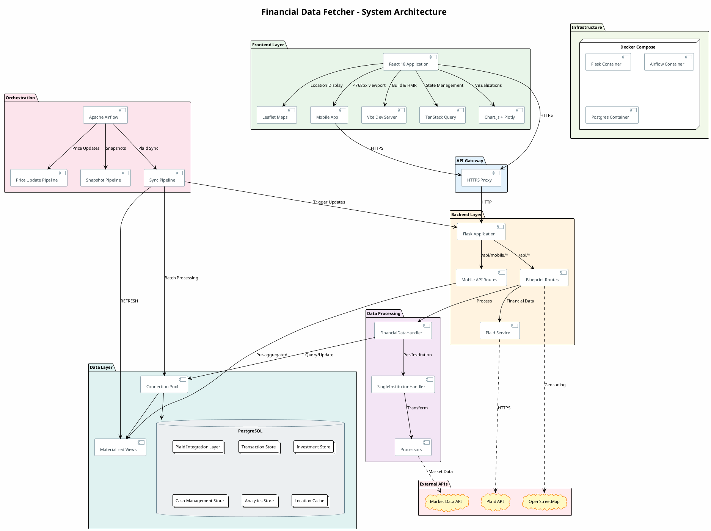
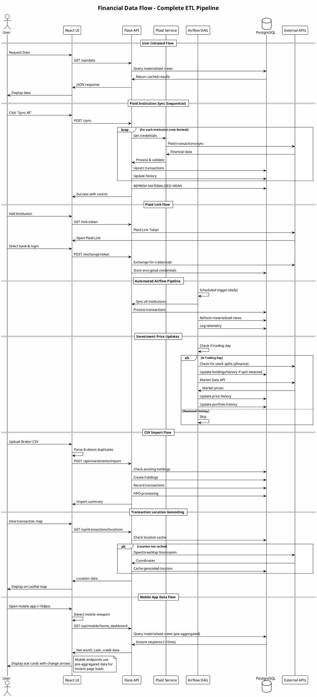

# Financial Data Fetcher

A comprehensive full-stack financial management application integrating with Plaid API for real-time financial data aggregation, investment portfolio tracking, and automated data pipeline orchestration.

> **[View Changelog](changelog.html)** - See the complete development history with monthly summaries and key commits.

## Architecture Overview

This application is built as a modern full-stack solution with enterprise-grade data management capabilities:

- **Frontend**: React 18 with Vite build system, TanStack Query for state management
- **Backend**: Flask (Python) with modular blueprint architecture
- **Database**: PostgreSQL with sophisticated financial data modeling
- **Orchestration**: Apache Airflow for automated ETL pipelines
- **API Integration**: Plaid API for multi-institution financial data

### System Architecture Diagram



### Data Flow Architecture



## Key Features

### Mobile Experience
- **Apple Stocks-Inspired Design**: Dark theme mobile app with green/red accent colors
- **5-Tab Navigation**: Home, Activity, Cash Flow, Invest, Accounts with bottom navigation
- **Home Dashboard**: Net Worth, Cash Available, Credit Used stat cards with daily change arrows
- **Activity Tab**: Transactions and subscriptions with inline expand, swipe-to-categorize, long-press actions
- **Cash Flow Tab**: Trend line chart with pill time selectors (1W, 1M, 3M, 1Y, YTD)
- **Invest Tab**: Simplified portfolio view with total value and holdings list
- **Accounts Tab**: Expandable accordion groups by account type with totals
- **Touch Gestures**: Pull-to-refresh, swipe actions, long-press context menus
- **Mobile-Optimized APIs**: Pre-aggregated endpoints for instant page loads

### Financial Data Management
- **Multi-Institution Support**: Connect and sync data from multiple banks and financial institutions
- **Real-time Transaction Syncing**: Automated transaction categorization and tracking
- **Transaction Location Mapping**: Geocoded transaction locations with interactive map visualization
- **Investment Portfolio Tracking**: Stock holdings, performance metrics, and capital gains calculations
- **Net Worth Monitoring**: Historical net worth tracking with asset allocation analysis and transfer in-transit handling
- **Cash Flow Analysis**: Income and expense tracking with transfer filtering and flexible date range presets
- **Monthly Cash Flow Impact**: Comprehensive monthly analysis of income, expenses, and investment gains

### Investment Management
- **Portfolio Dashboard**: Real-time portfolio valuation with performance metrics
- **Stock Trading**: Buy/sell functionality with FIFO tax lot tracking
- **Stock Split Handling**: Automatic detection and adjustment of stock splits via Airflow DAG
- **CSV Import**: Bulk import investment transactions from brokers
- **Duplicate Detection**: Intelligent handling of duplicate transactions across imports
- **Market Data**: Cached pricing with scheduled updates via Airflow DAGs
- **Holdings Comparison**: Compare current holdings vs sold positions with "what if held" analysis
- **Transfer Smoothing**: Intelligent smoothing of transfers in portfolio charts to prevent sudden jumps

### Data Pipeline & ETL
- **Automated Syncing**: Scheduled data pulls via Airflow DAGs
- **Stock Split Detection**: Automatic detection of recent splits with holdings/history adjustment
- **Data Quality Checks**: Validation and consistency monitoring
- **Transaction Processing**: Complex SQL transformations for financial analytics
- **API Telemetry**: Comprehensive tracking of all API calls
- **Raw Data Capture**: Serialization and storage of complete API payloads for debugging and analysis
- **Materialized Views**: Pre-computed aggregations for significantly faster API responses (100x speedup)

## Project Structure

```
├── app/                          # Flask backend application
│   ├── app.py                   # Main Flask application
│   ├── config.py                # Environment configuration
│   ├── plaid_service.py         # Plaid API integration
│   ├── database_info.sql        # Consolidated database schema
│   ├── routes/                  # API endpoints
│   │   ├── analytics.py         # Financial analytics & date range presets
│   │   ├── api_routes.py        # Core API endpoints
│   │   ├── investments.py       # Portfolio operations, realized gains, CSV import
│   │   ├── net_worth_routes.py  # Net worth calculations
│   │   └── transactions.py      # Transaction management
│   └── financial_data/          # Clean architecture data layer
│       ├── db_operations/       # Database access layer
│       ├── handlers/            # Business logic coordination
│       ├── processors/          # Data transformation
│       ├── services/            # Domain-specific services
│       └── utils/               # Shared utilities
│
├── frontend/                    # React frontend application
│   ├── src/
│   │   ├── main.jsx            # Application entry point
│   │   ├── App.jsx             # Main app component with routing
│   │   ├── components/         # Reusable UI components
│   │   │   ├── common/         # Header, Sidebar, shared components
│   │   │   ├── dashboard/      # Dashboard widgets
│   │   │   ├── investments/    # Investment components
│   │   │   ├── networth/       # Net worth visualizations
│   │   │   └── mobile/         # Mobile-specific components
│   │   │       ├── MobileApp.jsx          # Mobile app wrapper
│   │   │       ├── MobileBottomNav.jsx    # 5-tab bottom navigation
│   │   │       └── tabs/                  # Tab-specific views
│   │   │           ├── HomeTab/           # Net worth, cash, credit cards
│   │   │           ├── ActivityTab/       # Transactions, subscriptions
│   │   │           ├── CashFlowTab/       # Income/expense charts
│   │   │           ├── InvestTab/         # Portfolio summary
│   │   │           └── AccountsTab/       # Account balances
│   │   ├── hooks/              # Custom React hooks
│   │   │   └── useIsMobile.js  # Mobile detection hook
│   │   ├── pages/              # Route-level pages
│   │   └── context/            # React context providers
│   │       └── MobileNavContext.jsx  # Mobile tab state
│   ├── vite.config.js          # Vite config with API proxy
│   └── package.json            # Frontend dependencies
│
├── airflow/                    # Apache Airflow orchestration
│   └── dags/                   # Data pipeline definitions
│       ├── sync_pipeline.py          # Main sync + materialized view refresh
│       ├── stock_price_tracker_dag.py # Stock price updates + split detection
│       └── snapshot_pipeline.py      # Net worth snapshot calculations
│
├── scripts/                    # Utility scripts
│   ├── refetch_split_adjusted_prices.py   # Refetch prices with split adjustment
│   └── update_portfolio_history_prices.py # Update portfolio history from price data
│
├── docker-compose.yml          # Multi-service orchestration
├── Dockerfile                  # Custom Airflow image
├── Makefile                    # Build automation
└── requirements.txt            # Python dependencies
```

## Technical Implementation

### Backend Architecture

**Flask Application**:
- Modular blueprint architecture with `/api/` prefix
- RESTful API design with comprehensive error handling
- Database connection pooling for performance
- Plaid webhook support for real-time updates

**Data Layer** (Clean Architecture):
- **db_operations**: Low-level database access with prepared statements
- **handlers**: Main orchestrator and per-institution refresh handlers
- **processors**: Data transformation and validation
- **services**: Domain-specific business rules (investments, net worth)
- **utils**: Database connections and shared helpers

**Key Backend Patterns**:
- Sequential institution processing with rate limiting
- Materialized view refresh after every sync
- Plaid Link update mode for re-authentication without data loss
- FIFO stock sale processing for capital gains tracking

### Frontend Architecture

**React + Vite**:
- Modern React 18 with functional components
- TanStack Query for server state management
- Vite dev server with HTTPS and API proxy
- CSS Modules for component styling
- Chart.js and Plotly.js for data visualization
- Responsive design with dedicated mobile experience

**Mobile Architecture**:
- Viewport-based detection (768px breakpoint) automatically switches between desktop and mobile
- Complete separation of mobile/desktop UX - desktop view unchanged
- Mobile-specific context for tab state management
- Touch gesture support (swipe, long-press, pull-to-refresh)
- Mobile-optimized API endpoints for instant page loads

**Pages** organized by domain:

| Category | Pages |
|----------|-------|
| **Financial** | Expenses, Transactions, Payment History, Subscriptions, Analysis |
| **Investment** | Investments, Net Worth, All Balances |
| **Admin/Dev** | SQL Editor, Database Schema, Model Explorer, Route Map, Institutions |

**Key Components**:
- `PortfolioChart`: Drag-to-select with gain/loss calculation, crosshair plugin
- `TransactionImporter`: CSV parsing with duplicate detection (1% price tolerance)
- `NetWorthChart`: Historical trends with asset allocation breakdown
- `TransferDetectionBanner`: Pattern-based transfer identification
- `RealizedGains`: Three-tab view (summary/detailed/by-symbol) with FIFO tracking

### Database Design

**Transaction-Based Accounting**:
- All cash balances calculated from transaction sums
- No stored balances to prevent discrepancies
- FIFO stock sale tracking for accurate tax reporting

**Data Stores** organized by domain:

| Domain | Description |
|--------|-------------|
| **Plaid Integration** | Institution connections and encrypted credentials |
| **Transactions** | Transaction records with categorization and mappings |
| **Investments** | Portfolio holdings, sales history, price data, stock splits |
| **Cash Management** | Cash transactions and account balances |
| **Transfers** | Custom transfer patterns and detected transfers |
| **Analytics** | Net worth snapshots (with in-transit tracking), account history, earnings |

**Key Tables**:
- `portfolio_holdings`: Individual stock lots with cost basis
- `cash_transactions`: All cash movements with categorization
- `stock_sales`: Capital gains tracking with tax implications
- `stock_splits`: Stock split events for price/quantity normalization
- `net_worth_snapshots`: Daily snapshots with in_transit_amount for transfers between accounts

**Materialized Views** (for performance, refreshed via Airflow):
- Pre-aggregated transaction data
- Income aggregation with transfer filtering
- Expense aggregation with transfer filtering

**Calculated Views**:

| Category | Purpose |
|----------|---------|
| **Accounts** | Account listings by type |
| **Net Worth** | Current and historical net worth with breakdowns |
| **Investments** | Portfolio value, performance, capital gains |
| **Transactions** | Enhanced transaction views with mappings |
| **Stock Splits** | Cumulative split factors for price adjustment |

### Data Pipeline Architecture

**Apache Airflow DAGs**:
- Plaid sync + materialized view refresh
- Stock split detection with automatic holdings/history adjustment
- Market data price updates with market hours detection
- Daily price batch updates for all holdings
- Net worth snapshot calculations

**Stock Split Detection**:
- Checks yfinance for splits in last 60 days for all portfolio symbols
- Records new splits in `stock_splits` table
- Automatically adjusts `portfolio_holdings` (quantity × ratio, price ÷ ratio)
- Updates `portfolio_history` for dates before split
- Pre-populated with known major splits (NFLX, GOOGL, AMZN, TSLA, AAPL, NVDA)

**Performance Optimizations**:
- Materialized views reduced query time from 400ms to <1ms
- Database statistics materialized view provides 100x speedup (~720ms to ~7ms)
- Cached market data (no API calls on page load)
- Batch processing for efficiency
- Incremental data loading
- Connection pooling

## Key Features in Detail

### Investment CSV Import System

The application supports sophisticated CSV import for investment transactions:

**Supported Formats**:
- Major brokerage statements
- 401k/retirement account exports
- Custom CSV formats (configurable)

**Intelligent Processing**:
- Duplicate detection with price tolerance (1% variance allowed)
- Automatic cash flow calculation
- FIFO stock sale processing
- Capital gains tracking
- Transaction categorization

### Cash Flow Analysis

**Accurate Tracking**:
- Transfer transactions excluded to prevent double-counting
- Income vs expense categorization
- Monthly and yearly aggregations
- Custom date range analysis with presets (YTD, Prior YTD, Past 3/6/12 Months, All Time)
- 12-month rolling averages for expense comparisons

### Net Worth Monitoring

**Comprehensive Coverage**:
- Bank accounts (checking, savings)
- Investment portfolios
- Credit card balances
- Historical trending
- Asset allocation breakdown
- Transfer in-transit handling (money between accounts)

## Monitoring & Observability

### API Telemetry
- All external API calls tracked with response times
- Error rates and rate limits monitored
- Request/response correlation for debugging

### Data Quality
- Automated validation checks
- Consistency monitoring
- Error detection and logging
- Historical quality trends

## Security

### Token Encryption
- **AES-256-GCM Encryption**: All sensitive tokens encrypted at rest
- **macOS Keychain Integration**: Encryption keys stored securely in system Keychain
- **Migration Support**: Scripts to encrypt existing plaintext tokens
- **Verification Tools**: Encryption verification without exposing sensitive data

### Access Control
- **VPN-Based Access**: Remote access via Tailscale for secure mobile connectivity
- **No Public Endpoints**: Application only accessible on local network or VPN
- **Credential Protection**: Schema explorer hides sensitive database fields

