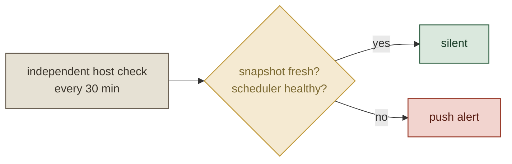

# Financial Data Fetcher

A comprehensive full-stack financial management application integrating with Plaid API for real-time financial data aggregation, investment portfolio tracking, and automated data pipeline orchestration.

> **[View Changelog](changelog.html)** - See the complete development history with monthly summaries and key commits.

## Architecture Overview

This application is built as a modern full-stack solution with enterprise-grade data management capabilities:

- **Frontend**: React 18 with Vite build system, TanStack Query for state management
- **Backend**: Flask (Python) with modular blueprint architecture
- **Database**: PostgreSQL with sophisticated financial data modeling
- **Orchestration**: Apache Airflow for automated ETL pipelines
- **API Integration**: Plaid API for multi-institution financial data
- **Brokerage Integration**: Schwab and SnapTrade APIs for multi-broker portfolio aggregation

### System Architecture Diagram

```mermaid
flowchart LR
    subgraph ext["External Sources"]
        BANK["Banking APIs<br/>transactions · balances"]
        BROK["Brokerage APIs<br/>holdings · activities"]
        MKT["Market Data<br/>prices · earnings"]
    end

    subgraph orch["Orchestration"]
        DAGS["Scheduled Pipelines<br/>sync · snapshots · prices"]
    end

    subgraph app["Application"]
        API["REST API<br/>grouped by domain"]
        SVC["Integration Services<br/>auth · ETL · notifications"]
        API --- SVC
    end

    subgraph data["Data Store"]
        DB[("Relational Database<br/>transactions · positions<br/>daily snapshots<br/>pre-aggregated views")]
    end

    subgraph clients["Clients"]
        WEB["Web Dashboard"]
        MOB["Mobile PWA<br/>optimized endpoints"]
    end

    subgraph notify["Notifications"]
        ALERT["Chat-based Alerts"]
    end

    AUTH["OIDC Auth"]

    ext -. raw data .-> orch
    orch -->|upsert| data
    orch -.-> notify
    app --> data
    app --> ext
    clients --> AUTH --> app
    data -. read-only .-> notify

    classDef extCls  fill:#f7d9c7,stroke:#b8552e,color:#7a3818,stroke-width:1.3px
    classDef orchCls fill:#f5ead2,stroke:#c19a3d,color:#7a6830,stroke-width:1.3px
    classDef appCls  fill:#dae8dd,stroke:#2c5e3f,color:#1a3d28,stroke-width:1.3px
    classDef dataCls fill:#d5dfeb,stroke:#2d4a6b,color:#1a2838,stroke-width:1.3px
    classDef cliCls  fill:#ebd8e1,stroke:#a8527a,color:#5a2a42,stroke-width:1.3px
    classDef notifCls fill:#f5e3ca,stroke:#b87d2b,color:#6a441a,stroke-width:1.3px
    classDef authCls fill:#e1dbe8,stroke:#6b5b7e,color:#3a2d48,stroke-width:1.3px

    class BANK,BROK,MKT extCls
    class DAGS orchCls
    class API,SVC appCls
    class DB dataCls
    class WEB,MOB cliCls
    class ALERT notifCls
    class AUTH authCls
```

### Data Flow Architecture

#### Banking Sync

```mermaid
flowchart LR
    CHK["connectivity check"]
    TOK["decrypt stored credentials"]
    SYNC["sync each connected institution<br/>in parallel"]
    PROC["categorize &amp; dedupe<br/>new transactions"]
    SNAP["write daily snapshot"]
    NOTIF["summary alert"]

    CHK --> TOK --> SYNC --> PROC --> SNAP --> NOTIF

    classDef setupCls   fill:#e6e1d4,stroke:#6b6154,color:#3a342b,stroke-width:1.3px
    classDef processCls fill:#dae8dd,stroke:#2c5e3f,color:#1a3d28,stroke-width:1.3px
    classDef storeCls   fill:#d5dfeb,stroke:#2d4a6b,color:#1a2838,stroke-width:1.3px
    classDef notifCls   fill:#f5e3ca,stroke:#b87d2b,color:#6a441a,stroke-width:1.3px

    class CHK,TOK setupCls
    class SYNC,PROC processCls
    class SNAP storeCls
    class NOTIF notifCls
```

#### Portfolio &amp; Pricing Sync

```mermaid
flowchart LR
    CHK["connectivity check"]
    SYM["gather held symbols"]
    subgraph PAR["in parallel"]
        direction TB
        PRICES["market prices &amp; earnings"]
        BROKER["brokerage sync<br/>positions · activities"]
        RET["retirement account sync<br/>contributions · balances"]
    end
    SNAP["roll into daily snapshot"]
    TOKEN["check broker auth health"]
    NOTIF["net-worth delta alert"]

    CHK --> SYM --> PAR --> SNAP --> TOKEN --> NOTIF

    classDef setupCls   fill:#e6e1d4,stroke:#6b6154,color:#3a342b,stroke-width:1.3px
    classDef extCls     fill:#f7d9c7,stroke:#b8552e,color:#7a3818,stroke-width:1.3px
    classDef processCls fill:#dae8dd,stroke:#2c5e3f,color:#1a3d28,stroke-width:1.3px
    classDef storeCls   fill:#d5dfeb,stroke:#2d4a6b,color:#1a2838,stroke-width:1.3px
    classDef securityCls fill:#e1dbe8,stroke:#6b5b7e,color:#3a2d48,stroke-width:1.3px
    classDef notifCls   fill:#f5e3ca,stroke:#b87d2b,color:#6a441a,stroke-width:1.3px

    class CHK,SYM setupCls
    class PRICES,BROKER,RET extCls
    class SNAP storeCls
    class TOKEN securityCls
    class NOTIF notifCls
```

#### Operational Liveness

```mermaid
flowchart LR
    CRON["independent host check<br/>every 30 min"]
    CHECK{"snapshot fresh?<br/>scheduler healthy?"}
    OK["silent"]
    ALERT["push alert"]

    CRON --> CHECK
    CHECK -- yes --> OK
    CHECK -- no --> ALERT

    classDef setupCls  fill:#e6e1d4,stroke:#6b6154,color:#3a342b,stroke-width:1.3px
    classDef decideCls fill:#f5ead2,stroke:#c19a3d,color:#7a6830,stroke-width:1.3px
    classDef okCls     fill:#dae8dd,stroke:#2c5e3f,color:#1a3d28,stroke-width:1.3px
    classDef alertCls  fill:#f2d4cf,stroke:#9a3b2b,color:#5a1e14,stroke-width:1.3px

    class CRON setupCls
    class CHECK decideCls
    class OK okCls
    class ALERT alertCls
```

## Component Catalog

A conceptual map of the moving parts. Specifics intentionally left to the code.

### Backend

| Layer | Responsibility |
|---|---|
| API blueprints | Grouped by domain — banking, brokerage, transactions, investments, analytics, net worth, categorization rules, reimbursements, admin |
| Integration services | Wrap each external provider with token management, pagination, retries, and idempotent upserts |
| ETL handlers | Normalize raw provider responses into canonical records; dedupe; apply user-defined categorization rules |
| Auth | OIDC with a self-hosted identity provider; bearer tokens injected automatically on every request |

### Orchestration

Two scheduled pipelines handle the bulk of data movement:

- **Banking pipeline** — runs several times daily, pulls transactions and balances from connected banks and credit cards, writes a daily snapshot, pushes a summary alert.
- **Portfolio pipeline** — runs once per weekday after market close, refreshes market prices, syncs brokerage and retirement accounts, updates the investment section of the daily snapshot, pushes a net-worth-delta alert.

A third, host-level liveness check runs independently of the orchestrator so it can surface failures *in* the orchestrator.

### Data

A single relational database organized into a few logical areas:

- Canonical transactions and balances from banks
- Per-broker positions and activities
- Daily net-worth snapshots going back years
- Pre-aggregated views for heavy reporting queries

### Clients

- **Web dashboard** — multi-page desktop app with deep analytics, transaction management, and portfolio views
- **Mobile PWA** — tab-based navigation over endpoints pre-shaped for mobile consumption; installable to a phone home screen

### Notifications

Daily activity summaries and net-worth updates are pushed through chat-based channels. Operational alerts (token expiring, pipeline stale, scheduler down) use the same channels so everything lands in one place.

### Infrastructure

Containerized and self-hosted. Public access is mediated by a tunnel and an identity provider rather than direct port exposure. A lightweight static site handles any vendor-approval flow without involving the real application.

---

## Key Features

### Mobile Experience

Installable progressive web app with a tab-based bottom navigation, designed for quick daily check-ins rather than deep analysis. Each tab consumes pre-aggregated endpoints so page loads feel instant. Gesture support (pull-to-refresh, swipe, long-press) is layered on where it matters without replacing tap targets.

Tabs cover: home summary, activity, cash flow, investments, accounts, brokerage, income, payments, subscriptions, and net worth.

### Financial Data Management

- Aggregates transactions and balances across multiple banks and credit cards
- Auto-categorizes using user-defined rules, with per-transaction overrides
- Builds a continuous net-worth history by bridging statement-era records with live API data
- Links peer-to-peer payments (splits and reimbursements) back to the original expenses
- Surfaces transaction locations on a map when geocoded data is available

### Investment Management

- Portfolio dashboard with per-symbol performance, realized and unrealized gains
- Lot-aware cost-basis tracking with FIFO defaults
- Automatic handling of stock splits detected from market data
- Multi-broker aggregation so a single position is visible across whichever providers hold it
- Support for bulk CSV import when a provider's history needs to be seeded

### Data Pipeline

- Orchestrator pulls each connected source on a schedule, retries transient failures, and writes idempotent upserts
- Pre-aggregated views refresh at the end of each sync so reporting queries stay fast
- An independent external check surfaces failures *in* the orchestrator itself
- Chat-based alerts summarize each run and notify on operational issues

## Technical Implementation

### Backend

Python web framework serving a JSON API grouped by domain. Integration services wrap each external provider with credential management, pagination, retries, and normalization. A layered ETL path moves raw responses through processors (dedupe, categorize) into idempotent database writes.

### Frontend

React single-page app with client-side routing, server state managed by a query/caching library, and a clear desktop/mobile split. Mobile views consume dedicated endpoints tuned for small-screen consumption. Charts use a mix of rich and lightweight libraries depending on the complexity of the visualization.

### Database

A relational store with domain-partitioned schemas. Canonical records for transactions, balances, positions, and daily snapshots. Pre-aggregated views handle the expensive reporting queries so user-facing endpoints can stay snappy.

### Data Pipeline

Scheduled pipelines run on an orchestrator with explicit task dependencies and trigger rules that favor availability over strict upstream success — stale-but-present beats gaps. Market data and broker sync tasks run in parallel where safe. Pre-aggregated views are refreshed at the tail of each run.

## Key Capabilities in Detail

### Bulk Import

Provider-exported CSV files can be ingested directly. The importer handles duplicate detection with a small price tolerance, applies the same categorization rules as the live sync, and writes through the same idempotent path so there is no "import drift."

### Cash Flow

Transfers between a user's own accounts are filtered out of income and expense roll-ups to avoid double counting. Date-range presets (YTD, prior YTD, rolling 3/6/12-month windows, all time) drive consistent comparisons across pages.

### Net Worth

Daily snapshots back-fill from statement data where available and continue forward with live API data. In-transit amounts between a user's own accounts are tracked so mid-transfer snapshots don't show phantom dips.

## Operations

### Observability

Each external API call is logged with timing so slow or failing providers can be identified. Data-quality checks catch obvious inconsistencies (missing fields, impossible values) before they propagate.

### Conversational Interfaces

Chat-based assistants offer natural-language access to the data for quick questions. A separate error-monitoring assistant watches container logs and surfaces failures with actionable context.

## Security

- Containerized services with private-network binding; public access is mediated by a tunnel and an identity provider rather than direct port exposure
- OIDC authentication with bearer tokens; no shared static keys in production
- Provider credentials encrypted at rest; encryption keys held outside the application
- Remote access layered behind a VPN overlay so the ingress surface stays minimal
